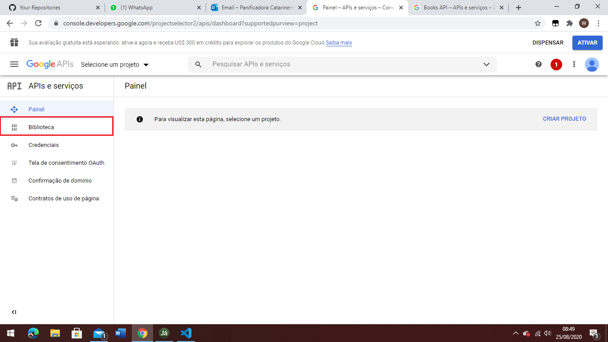
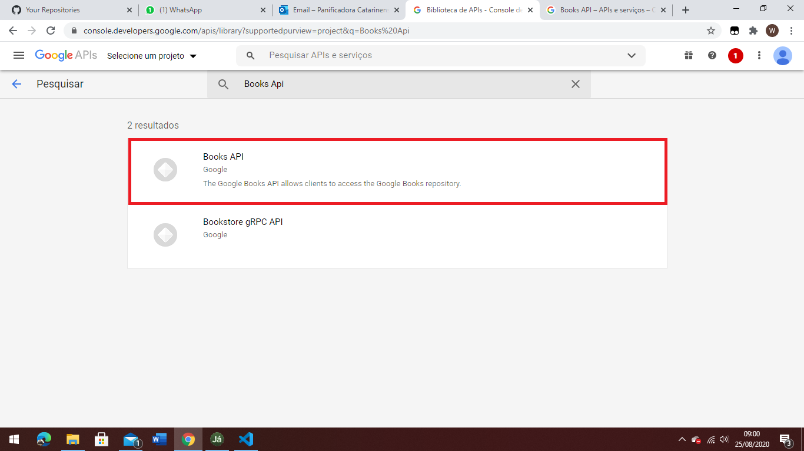
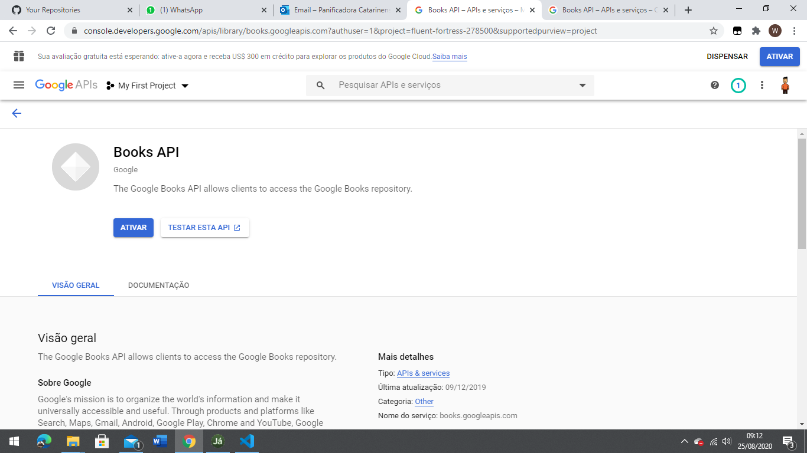

# Book Finder

Site desenvolvido para o aprendizado de como utlizar da api do google books.  
O site tem a função de buscador de livros, ao inserir o nome do livro será retornado todos os livros com titulos parecidos.

## Adquirindo sua key

Para que você consiga rodar o projeto é nescessário que você pegue a chave para utilizar na api   
para isso é só acessar o site https://console.developers.google.com/  
   
### Vá na aba biblioteca
      

### Após isso pesquise por Books Api e clique na primeira opção
   

### Caso você não tenha nenhum projeto criado vá em selecione um projeto e no canto superior direito clique em Novo Projeto 

### Apos isso e só clicar em ativar

### E ir em criar credencias, só preencher o mini formulário e você irá receber sua chave.   

## Instalação

Abra o terminal do seu computador, va ate a pasta em que deseja armaazenar os arquivos  
e digite os comandos abaixo:

        $ git clone https://github.com/matiussi04/book-finder
        $ cd book-finder  
        $ npm install 

## Colocando a Key no Projeto

Para colocar sua key no projeto é so ir na pasta src / server no arquivo api.js é so trocar o "Your Key" pela key que você adquiriu

## Rodar o Projeto

Para executar o projeto é so abrir o seu terminal e colocar

        $ npm start